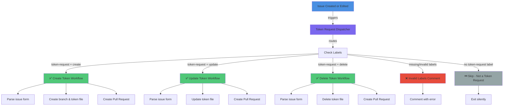

# Token Request Workflows

This document describes the optimized GitHub Actions pipeline for handling design token requests (create, update, delete).

## Architecture Overview

The workflow system uses a **single-entry dispatcher pattern**:

1. **Single Entry Point**: All issue events (opened/edited) trigger the `Token Request Dispatcher` workflow only
2. **Intelligent Routing**: The dispatcher analyzes issue labels to determine the action type
3. **Selective Execution**: Only the matching workflow runs (create, update, or delete)
4. **Concurrency Control**: Only one run per issue is active at a time; older runs are cancelled

This prevents multiple workflows from running in parallel and ensures clean, predictable execution.

## Workflow Flow



## Usage

### Creating a Token Request Issue

1. **Go to Issues** → **New Issue**
2. **Choose a template**:
   - **🎨 Create New Token** → Labels: `token-request`, `create`
   - **✏️ Update Existing Token** → Labels: `token-request`, `update`
   - **🗑️ Delete Token** → Labels: `token-request`, `delete`
3. **Fill out the form** with token details
4. **Submit** the issue

### What Happens Automatically

The `Token Request Dispatcher` will:

1. ✅ **Route** the issue based on its labels (create/update/delete)
2. ✅ **Validate** that exactly one action label is present
3. ✅ **Trigger** the appropriate workflow
4. ✅ **Create a PR** with token changes for review
5. ✅ **Comment on the issue** with the PR link and status

If labels are invalid (e.g., both `create` and `update`, or missing action label):
- ❌ The dispatcher comments explaining the error
- No PR is created until labels are corrected

## Workflow Files

### Dispatcher Workflow
- **File**: `.github/workflows/token-request-dispatcher.yaml`
- **Trigger**: Issue opened or edited
- **Responsibilities**:
  - Route based on labels (create/update/delete)
  - Validate label configuration
  - Call the appropriate reusable workflow
  - Enforce concurrency (one run per issue)

### Create Token Workflow
- **File**: `.github/workflows/create-token.yaml`
- **Trigger**: Called by dispatcher when `create` label present
- **Actions**:
  - Parses the create form
  - Generates a new token file
  - Creates a PR with the new token

### Update Token Workflow
- **File**: `.github/workflows/update-token.yaml`
- **Trigger**: Called by dispatcher when `update` label present
- **Actions**:
  - Parses the update form
  - Modifies an existing token
  - Creates a PR with the changes

### Delete Token Workflow
- **File**: `.github/workflows/delete-token.yaml`
- **Trigger**: Called by dispatcher when `delete` label present
- **Actions**:
  - Parses the delete form
  - Removes the token file
  - Creates a PR with the deletion

## Workflow Inputs

All three token workflows are **reusable workflows** and receive inputs from the dispatcher:

| Input | Type | Purpose |
|-------|------|---------|
| `issue-number` | number | Issue ID for comments and PR linking |
| `issue-title` | string | Issue title used in PR title and branch name |
| `issue-body` | string | Issue body containing the form data |
| `issue-action` | string | (create only) The GitHub event action (opened/edited) |

## Key Features

### 🔒 Concurrency Control
- Only one workflow run per issue is active
- Older runs are automatically cancelled
- Prevents duplicate PRs and resource waste

### 🎯 Smart Routing
- Labels determine which workflow runs
- Validation ensures only one action label per issue
- Invalid configurations are caught early with user feedback

### 🔗 Issue-to-PR Linking
- Each generated PR closes the source issue automatically
- PR comments link back to the issue
- Clear audit trail for token changes

### 📝 Form-Based Parsing
- Issue forms (`issue-ops/parser`) extract structured data
- Templates ensure consistent token information
- Reduces manual validation

## Troubleshooting

### Issue Shows No PR Created

**Possible causes:**
1. **Missing labels**: Ensure issue has both `token-request` and one of `create`/`update`/`delete`
2. **Invalid form data**: Check that all required fields in the form are filled
3. **Token already exists** (create): The token name may already be in use
4. **Token path not found** (update/delete): The token path may be incorrect

**Solution**: Check the dispatcher comment on the issue for details, update the issue, and re-run.

### Multiple Action Labels

**Error message**: "This token request issue must have exactly one action label: create, update, or delete."

**Solution**: Remove all but one of `create`, `update`, `delete` labels, then edit the issue to re-trigger.

### Workflow Failed During Token Operation

**Solution**: 
1. Check the dispatcher job logs for parsing errors
2. Review the token script output
3. Validate token data format matches the schema
4. Create a new issue with corrected data

## File Organization

```
.github/
├── workflows/
│   ├── token-request-dispatcher.yaml    # Entry point (issues: opened/edited)
│   ├── create-token.yaml                # Reusable: create token
│   ├── update-token.yaml                # Reusable: update token
│   ├── delete-token.yaml                # Reusable: delete token
│   ├── build-tokens.yaml                # Independent: CI build
│   └── publish-npm.yaml                 # Independent: publish to npm
├── ISSUE_TEMPLATE/
│   ├── create-token.yaml                # Form: create token issue
│   ├── update-token.yaml                # Form: update token issue
│   └── delete-token.yaml                # Form: delete token issue
├── scripts/
│   ├── create-token.ts                  # Implementation: create
│   ├── update-token.ts                  # Implementation: update
│   ├── delete-token.ts                  # Implementation: delete
│   └── token-validator.ts               # Validation utilities
└── WORKFLOWS_README.md                  # This file
```

## Performance Benefits

| Metric | Before | After |
|--------|--------|-------|
| Pipelines per issue event | 3 parallel | 1 dispatcher + 1 selected |
| Decision time | ~30s per workflow | ~5s in router |
| Wasted runs | High (wrong type runs) | Zero (router prevents it) |
| API calls | Multiple × 3 | Single batch |
| User wait time | Longer (concurrent) | Shorter (single path) |

## Related Documentation

- **Token Schema**: See `tokens/` directory and `README.md`
- **Token Validation**: `.github/scripts/token-validator.ts`
- **Build Pipeline**: `.github/workflows/build-tokens.yaml`
- **Publishing**: `.github/workflows/publish-npm.yaml`
