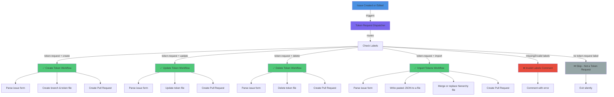

# Token Request Workflows

This document describes the optimized GitHub Actions pipeline for handling design token requests (create, update, delete, import).

## Architecture Overview

The workflow system uses a **single-entry dispatcher pattern**:

1. **Single Entry Point**: All issue events (opened/edited) trigger the `Token Request Dispatcher` workflow only
2. **Intelligent Routing**: The dispatcher analyzes issue labels to determine the action type
3. **Selective Execution**: Only the matching workflow runs (create, update, delete, or import)
4. **Concurrency Control**: Only one run per issue is active at a time; older runs are cancelled

This prevents multiple workflows from running in parallel and ensures clean, predictable execution.

## Workflow Flow


```mermaid
graph TD
    A["Issue Created or Edited"] -->|triggers| B["Token Request Dispatcher"]
    B -->|routes| C["Check Labels"]
    
    C -->|token-request + create| D["✅ Create Token Workflow"]
    C -->|token-request + update| E["✅ Update Token Workflow"]
    C -->|token-request + delete| F["✅ Delete Token Workflow"]
    C -->|token-request + import| I["✅ Import Tokens Workflow"]
    
    C -->|missing/invalid labels| G["❌ Invalid Labels Comment"]
    C -->|no token-request label| H["⏭️ Skip - Not a Token Request"]
    
    D --> D1["Parse issue form"]
    D --> D2["Create branch & token file"]
    D --> D3["Create Pull Request"]
    
    E --> E1["Parse issue form"]
    E --> E2["Update token file"]
    E --> E3["Create Pull Request"]
    
    F --> F1["Parse issue form"]
    F --> F2["Delete token file"]
    F --> F3["Create Pull Request"]
    
    I --> I1["Parse issue form"]
    I --> I2["Write pasted JSON to a file"]
    I --> I3["Merge or replace hierarchy file"]
    I --> I4["Create Pull Request"]
    
    G --> G1["Comment with error"]
    H --> H1["Exit silently"]
    
    style A fill:#4A90E2
    style B fill:#7B68EE
    style D fill:#50C878
    style E fill:#50C878
    style F fill:#50C878
    style I fill:#50C878
    style G fill:#E74C3C
    style H fill:#95A5A6
```

## Usage

### Creating a Token Request Issue

1. **Go to Issues** → **New Issue**
2. **Choose a template**:
   - **🎨 Create New Token** → Labels: `token-request`, `create`
   - **✏️ Update Existing Token** → Labels: `token-request`, `update`
   - **🗑️ Delete Token** → Labels: `token-request`, `delete`
   - **📥 Import Tokens** → Labels: `token-request`, `import`
3. **Fill out the form** with token details
4. **Submit** the issue

### What Happens Automatically

The `Token Request Dispatcher` will:

1. ✅ **Route** the issue based on its labels (create/update/delete/import)
2. ✅ **Validate** that exactly one action label is present
3. ✅ **Trigger** the appropriate workflow
4. ✅ **Create a PR** with token changes for review
5. ✅ **Comment on the issue** with the PR link and status

If labels are invalid (e.g., both `create` and `update`, or missing action label):
- ❌ The dispatcher comments explaining the error
- No PR is created until labels are corrected

## Workflow Files

### Dispatcher Workflow
- **File**: `.github/workflows/token-request-dispatcher.yaml`
- **Trigger**: Issue opened or edited
- **Responsibilities**:
  - Route based on labels (create/update/delete/import)
  - Validate label configuration
  - Call the appropriate reusable workflow
  - Enforce concurrency (one run per issue)

### Create Token Workflow
- **File**: `.github/workflows/create-token.yaml`
- **Trigger**: Called by dispatcher when `create` label present
- **Actions**:
  - Parses the create form
  - Generates a new token file
  - Creates a PR with the new token

### Update Token Workflow
- **File**: `.github/workflows/update-token.yaml`
- **Trigger**: Called by dispatcher when `update` label present
- **Actions**:
  - Parses the update form
  - Modifies an existing token
  - Creates a PR with the changes

### Delete Token Workflow
- **File**: `.github/workflows/delete-token.yaml`
- **Trigger**: Called by dispatcher when `delete` label present
- **Actions**:
  - Parses the delete form
  - Removes the token file
  - Creates a PR with the deletion

### Import Tokens Workflow
- **File**: `.github/workflows/import-tokens.yaml`
- **Trigger**: Called by dispatcher when `import` label present
- **Actions**:
  - Parses the import form
  - Writes the pasted DTCG document to a file via an env var — never into a shell
    argument or a `${{ }}` interpolation, since the payload is a whole JSON
    document supplied by a stranger
  - Merges it onto, or replaces, `tokens/{hierarchy}/tokens.json`
  - Creates a PR whose body is the summary the script wrote

#### Import modes

| Mode | Behaviour |
|------|-----------|
| `merge` | Overlays the document. Tokens not mentioned are kept; tokens mentioned are replaced outright, so stale `$type` / `$description` does not linger. |
| `replace` | The document becomes the whole file. Anything missing from it is removed, and the import is rejected if another layer still references what would go. |

The document is taken as DTCG-conform and is not normalized: `$type` may sit on a
group and be inherited by its descendants.

#### Size ceiling

GitHub caps an issue body at 65,536 characters, which leaves ~64,700 for the JSON
after the form's other fields. Measured against real DTCG shapes that is ~1,380
lean tokens, ~355 written the way this repository writes them, or ~150 with long
paths, long descriptions and `$extensions`. The cap is enforced by GitHub **on
submit**: an over-long issue is never created, so no workflow runs and no comment
can explain it. The requester sees GitHub's own `body is too long` error.

## Workflow Inputs

All four token workflows are **reusable workflows** and receive inputs from the dispatcher:

| Input | Type | Purpose |
|-------|------|---------|
| `issue-number` | number | Issue ID for comments and PR linking |
| `issue-title` | string | Issue title used in PR title and branch name |
| `issue-body` | string | Issue body containing the form data |
| `issue-action` | string | (create only) The GitHub event action (opened/edited) |

## Key Features

### 🔒 Concurrency Control
- Only one workflow run per issue is active
- Older runs are automatically cancelled
- Prevents duplicate PRs and resource waste

### 🎯 Smart Routing
- Labels determine which workflow runs
- Validation ensures only one action label per issue
- Invalid configurations are caught early with user feedback

### 🔗 Issue-to-PR Linking
- Each generated PR closes the source issue automatically
- PR comments link back to the issue
- Clear audit trail for token changes

### 📝 Form-Based Parsing
- Issue forms (`issue-ops/parser`) extract structured data
- Templates ensure consistent token information
- Reduces manual validation
- **Dropdowns arrive as JSON arrays.** `parsed_hierarchy` is `["universal"]`, not
  `universal`. `parseDropdownValue` in `token-common.ts` unwraps that (and the bare
  `[universal]` form, and a plain string) at the CLI boundary, so every value
  behind it is a validated `Hierarchy` or `ImportMode` rather than a loose string

### ✅ Shared Validation
Every operation — create, update, delete and import — validates the whole token
set before writing, not just the file being touched:

- **References resolve across hierarchies.** Token paths carry no hierarchy prefix,
  so `assertTreeValid` loads every hierarchy and overlays the modified tree. Each
  layer may reference only itself and layers below it
- **Deletes are validated too.** Removing a token another layer still references is
  rejected, and the file is left untouched
- **Replaces are validated too.** An `import --mode replace` that would drop a
  referenced token is rejected for the same reason
- **Every malformed path is reported at once**, so one run tells you everything
  that needs fixing
- **`$type` may sit on a group** and is inherited by its descendants, per DTCG

## Troubleshooting

### Issue Shows No PR Created

**Possible causes:**
1. **Missing labels**: Ensure issue has both `token-request` and one of `create`/`update`/`delete`/`import`
2. **Invalid form data**: Check that all required fields in the form are filled
3. **Token already exists** (create): The token name may already be in use
4. **Token path not found** (update/delete): The token path may be incorrect
5. **Reference still points at it** (delete, or `import --mode replace`): another
   layer references the token being removed, so the write is refused
6. **Malformed document** (import): The JSON did not parse, or a path segment is not
   kebab-case — the script logs every offending path in one run
7. **No changes**: every token in the request already matches the file
8. **Issue was never created** (import): a body over 65,536 characters is rejected by
   GitHub on submit, so no workflow ever ran — see [Size ceiling](#size-ceiling)

**Solution**: open the workflow run under the **Actions** tab and read the script
output. Note two gaps worth knowing:

- **A failing script does not comment on the issue.** The commit step is skipped, so
  the `Handle no changes` step — which is gated on `changes == 'false'` — never
  fires either. The run logs are the only record
- **Only `create` and `import` comment on a no-op at all.** `update` and
  `delete` have no `Handle no changes` step, so a request that changes nothing
  finishes green and silent

### Multiple Action Labels

**Error message**: "This token request issue must have exactly one action label: create, update, delete, or import."

**Solution**: Remove all but one of `create`, `update`, `delete`, `import` labels, then edit the issue to re-trigger.

### Workflow Failed During Token Operation

**Solution**: 
1. Check the dispatcher job logs for parsing errors
2. Review the token script output
3. Validate token data format matches the schema
4. Create a new issue with corrected data

## File Organization

```
.github/
├── workflows/
│   ├── token-request-dispatcher.yaml    # Entry point (issues: opened/edited)
│   ├── create-token.yaml                # Reusable: create token
│   ├── update-token.yaml                # Reusable: update token
│   ├── delete-token.yaml                # Reusable: delete token
│   ├── import-tokens.yaml               # Reusable: import a DTCG document
│   ├── build-tokens.yaml                # Independent: CI test + build
│   └── publish-npm.yaml                 # Independent: test + build + publish to npm
├── ISSUE_TEMPLATE/
│   ├── create-token.yaml                # Form: create token issue
│   ├── update-token.yaml                # Form: update token issue
│   ├── delete-token.yaml                # Form: delete token issue
│   └── import-tokens.yaml               # Form: import a DTCG document
├── scripts/
│   ├── create-token.ts                  # CLI: create
│   ├── update-token.ts                  # CLI: update
│   ├── delete-token.ts                  # CLI: delete
│   ├── import-tokens.ts                 # CLI: import
│   └── token-common.ts                  # Shared tree, path and validation helpers
└── WORKFLOWS_README.md                  # This file
```

## Performance Benefits

| Metric | Before | After |
|--------|--------|-------|
| Pipelines per issue event | one per action type, all in parallel | 1 dispatcher + 1 selected |
| Decision time | ~30s per workflow | ~5s in router |
| Wasted runs | High (wrong type runs) | Zero (router prevents it) |
| API calls | Multiple, one set per action workflow | Single batch |
| User wait time | Longer (concurrent) | Shorter (single path) |

## Related Documentation

- **Token Schema**: See `tokens/` directory and `README.md`
- **Token Validation**: `src/token-validator.ts` (used by build pipeline and `.github/scripts/token-common.ts`)
- **Build Pipeline**: `.github/workflows/build-tokens.yaml`
- **Publishing**: `.github/workflows/publish-npm.yaml`
- **Script tests**: `tests/token-common.test.ts` and `tests/import-tokens.test.ts`
  run the CLIs as their own processes against a fixture, which is why they are
  slower than the rest of the suite

## CI Stages

- `build-tokens.yaml` installs dependencies, runs `npm test`, then runs `npm run build` before uploading artifacts or deploying Pages.
- `publish-npm.yaml` installs dependencies, runs `npm test`, then runs `npm run build` before publishing to npm.
